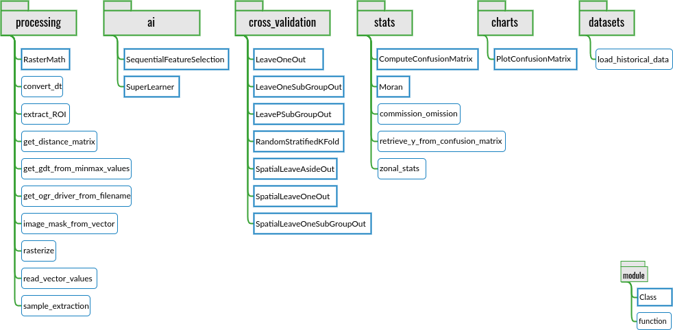

# Summary

`Museo ToolBox` is a python library dedicated to remote sensing.
Based on the fact that a majority of the needs in machine learning requires knowledge on how to transform your data and since it uses a lot of similar lines of codes on various projects but for the same usage (e.g., for reading and writing the raster block per block, computing a spectral index, fitting a model...), we offer with this library a new approach to compute functions on a raster.
For example, as in our field a recurrent usage is to fit a model and predict or to use some functions like one to compute for example a spectral index, `Museo ToolBox` automatically transforms the raster to match your needs (for learning a model, the user needs an array with one line per pixel and its features as columns). Other modules help users to follow state-of-the-art methods, such as spatial cross-validation, or learning methods with grid search and latest algorithms from scikit-learn.

Museo ToolBox's goal is to make working with raster data very easier for scientists or students and to promote the use of spatial cross-validation.

A [full documentation is available online on read the docs](http://museotoolbox.readthedocs.io/).

# Museo ToolBox functionnalities

`Museo ToolBox` is organized into several modules :

- [processing](https://museotoolbox.readthedocs.io/en/latest/modules/museotoolbox.processing.html) : raster and vector processing.
- [cross-validation](https://museotoolbox.readthedocs.io/en/latest/modules/museotoolbox.cross_validation.html) : stratified cross-validation compatible with scikit-learn
- [ai](https://museotoolbox.readthedocs.io/en/latest/modules/museotoolbox.ai.html) : machine learning module
- [charts](https://museotoolbox.readthedocs.io/en/latest/modules/museotoolbox.charts.html) : plot confusion matrix with F1 score, mean, or producer/user's accuracy.
- [stats](https://museotoolbox.readthedocs.io/en/latest/modules/museotoolbox.stats.html) : compute stats (like Moran's Index, confusion matrix, commision/omission) or extract truth and predicted label from confusion matrix.

Here are some main usages of `Museo ToolBox` :
1. [Read and write a raster block per block using your own function](https://museotoolbox.readthedocs.io/en/latest/modules/processing/museotoolbox.processing.RasterMath.html).
2. [Generate a cross-validation, including spatial cross-validation](https://museotoolbox.readthedocs.io/en/latest/auto_examples/index.html#cross-validation).
3. [Save the cross-validation in spatial vector files (shp, gpkg, sqlite...)](SaveToVectorLink).
4. [Learn with scikit-learn algorithms and extract accuracy from each cross-validation fold](https://museotoolbox.readthedocs.io/en/latest/modules/ai/museotoolbox.ai.SuperLearner.html).
5. [Plot confusion matrix and add f1 score or producer/user accuracy](https://museotoolbox.readthedocs.io/en/latest/modules/charts/museotoolbox.charts.PlotConfusionMatrix.html#museotoolbox.charts.PlotConfusionMatrix).
6. [Get the y_true and and y_predicted labels from a confusion matrix](https://museotoolbox.readthedocs.io/en/latest/modules/stats/museotoolbox.stats.retrieve_y_from_confusion_matrix.html).

## RasterMath

Available in `museotoolbox.processing.RasterMath`, RasterMath class is the keystone of ``Museo ToolBox``.

The question is simple : How can the transposition of array-compatible functions to raster compatibility be simplified ? The idea behind ``RasterMath`` is, if your function works with an array, then it will work directly with any raster.

So, what does ``RasterMath`` really do ? The answer is as simple as the question : the user only works with the array, so he doesn't have to manage the reading and writing process, the no-data management, the compression or the projection.

The objective of RasterMath is to **let the user only focus on his array-compatible function**, and to let RasterMath manage the raster part.

[Go to RasterMath documentation and examples](https://museotoolbox.readthedocs.io/en/latest/modules/processing/museotoolbox.processing.RasterMath.html)

## ai

The machine learning module is natively built to manage algorithm
from the ``scikit-learn`` using state of the art methods and good pratices (such as standardizing the input data). ``SuperLearner`` class optimizes the fit process by a grid search. There is also a Sequential Feature Selection protocol which supports number of components (e.g. a date is composed of 4 features, and you want to select the 4 features at once).

[Go to SuperLearner documentation and examples](https://museotoolbox.readthedocs.io/en/latest/modules/ai/museotoolbox.ai.SuperLearner.html)

## Cross-validation

``Museo ToolBox`` produces only stratified cross-validation, which means the split is made by respecting the size per class and not for the whole dataset.
For example the Leave-One-Out method will keep one sample of validation per class. As stated by [@olofsson_good_2014] *"stratified random sampling is a practical design that satisfies the
basic accuracy assessment objectives and most of the desirable design
criteria"*. For spatial cross-validation, see [@roberts_2017].

``Museo ToolBox`` offerts two differents types of cross-validation :

### Spatial-agnostic cross-validation

- Leave-One-Out.
- Leave-One-SubGroup-Out.
- Leave-P-SubGroup-Out (Percentage of subgroup per class).
- Random Stratified K-Fold.

### Spatial cross-validation

- Spatial Leave-One-Out [@karasiak_2019].
- Spatial Leave-Aside-Out.
- Spatial Leave-One-SubGroup-Out (using centroids to select one subgroup and remove other subgroups for the same class inside a specified distance buffer).

[Go to cross-validation documentation and examples](https://museotoolbox.readthedocs.io/en/latest/auto_examples/index.html#cross-validation)

# Acknowledgements

We acknowledge contributions from Mathieu Fauvel and beta-testers of this project.

# Figures

A short figure presents how ``Museo ToolBox`` is organized per module.

A short figure explains how ``RasterMath`` manages reading and writing rasters.

